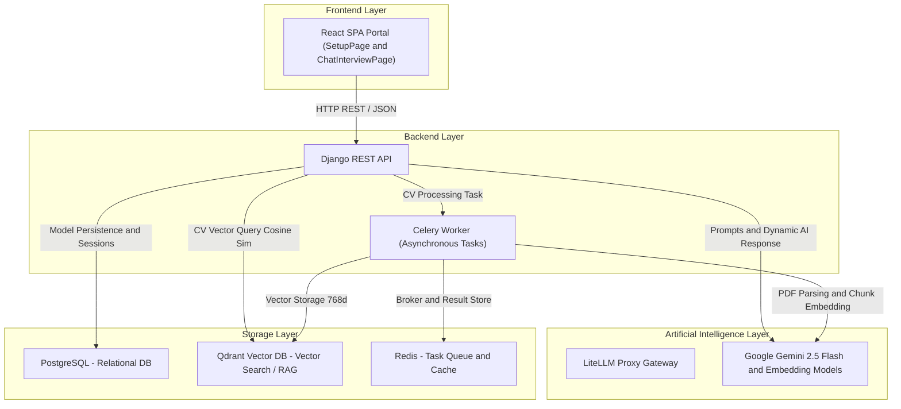
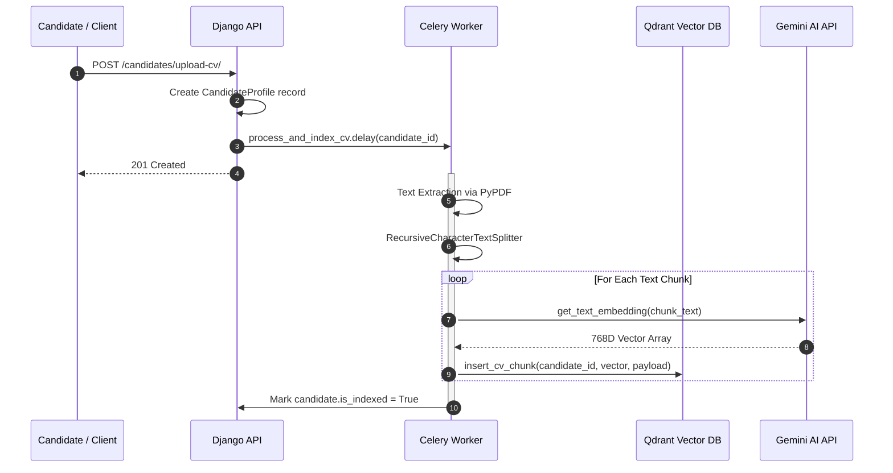
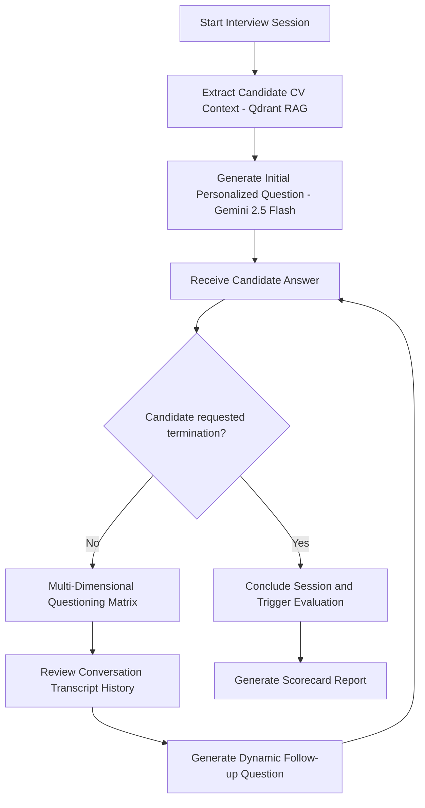

# 🤖 Aura AI Recruiter - Autonomous AI Interviewer & HR Platform

**Aura AI Recruiter** is an end-to-end autonomous artificial intelligence recruitment platform that processes candidate resumes (CVs) using a **RAG (Retrieval-Augmented Generation)** architecture with a vector database, conducts real-time dynamic candidate interviews, and generates detailed candidate performance scorecards upon completion.

---

## 📐 1. System Topology & Architecture

The system is designed following modern microservice and modular monolith principles.



### Layer Components:
- **Frontend:** Responsive portal built with React 18, Vite, TailwindCSS, and Lucide Icons.
- **Backend API:** Service-oriented backend powered by Django 6.1 & Django REST Framework.
- **Vector Database (Qdrant):** Stores CV text chunks as 768-dimensional Gemini embeddings and executes semantic similarity searches.
- **Asynchronous Tasks (Celery + Redis):** Manages background PDF extraction, text chunking, and embedding generation for uploaded CVs.
- **AI Integration:** Google Gemini 2.5 Flash and Gemini Embedding API.

---

## 🔄 2. Flow Algorithms & Execution Pipelines

### 📄 A. CV Indexing & RAG Pipeline
When a candidate uploads a CV, the system executes the following asynchronous workflow:



---

### 💬 B. Adaptive Dynamic Interview Flow
Aura Interview Engine dynamically adjusts questioning strategy based on candidate responses and CV context:



---

### 📊 C. AI Evaluation & Scoring Engine
When an interview concludes, `evaluate_interview_session_service` executes:

1. **Transcript Aggregation:** Compiles the complete interview transcript and candidate CV context.
2. **LLM Evaluation:** Gemini 2.5 Flash evaluates technical depth, communication skills, and role alignment.
3. **JSON Output Structure:**
   - `score`: Overall candidate score (0 to 100).
   - `verdict`: `HIRE`, `HOLD`, or `REJECT`.
   - `summary`: Executive summary of candidate performance.
   - `strengths` & `weaknesses`: Bulleted strengths and areas for improvement.
   - `hiring_recommendation`: Detailed feedback for hiring managers.

---

## 🛠️ 3. Technology Stack

| Layer | Technology |
| :--- | :--- |
| **Frontend** | React 18, Vite, TailwindCSS, Lucide Icons |
| **Backend** | Python 3.11+, Django 6.1, Django REST Framework |
| **Task Queue & Caching** | Celery, Redis |
| **Vector Database** | Qdrant Vector Search Engine |
| **Relational Database** | PostgreSQL |
| **AI / LLM** | Google Gemini 2.5 Flash, Gemini Embedding, LiteLLM Proxy |
| **Containerization** | Docker, Docker Compose |

---

## 📡 4. API Endpoints

| Method | Endpoint | Description |
| :--- | :--- | :--- |
| `POST` | `/jobs/` | Create job posting |
| `GET` | `/jobs/` | List job postings |
| `POST` | `/candidates/upload-cv/` | Create candidate profile & upload CV (Triggers async indexing) |
| `GET` | `/interviews/` | List interview sessions |
| `POST` | `/interviews/` | Start interview session & receive initial question |
| `POST` | `/interviews/answer/` | Submit answer & receive follow-up question |
| `POST` | `/interviews/evaluate/` | Conclude session & generate evaluation report |

---

## 🚀 5. Getting Started

### 🐳 Option A: Running with Docker Compose (Recommended)

1. Clone the repository:
   ```bash
   git clone <REPOSITORY_URL>
   cd AIpoweredRecuirment
   ```

2. Configure environment variables in `.env`:
   ```env
   GEMINI_API_KEY=your_gemini_api_key_here
   POSTGRES_DB=ai_recuirment
   POSTGRES_USER=postgres
   POSTGRES_PASSWORD=159357
   ```

3. Launch all services:
   ```bash
   docker compose up --build
   ```

---

### 💻 Option B: Manual Local Setup

#### 1. Backend Setup:
```bash
# Create and activate virtual environment
python -m venv .venv
# Windows: .\.venv\Scripts\activate
# Linux/Mac: source .venv/bin/activate

# Install dependencies
pip install -r requirements.txt

# Run migrations
python manage.py migrate

# Start backend server
python manage.py runserver 8000
```

#### 2. Frontend Setup:
```bash
cd frontend
npm install
npm run dev
```

---

## 📜 License
This project is licensed under the MIT License.
